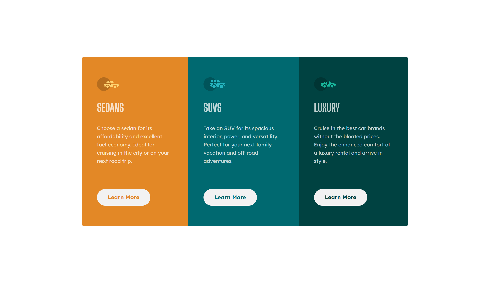

# Frontend Mentor - 3-column preview card component solution

This is a solution to the [3-column preview card component challenge on Frontend Mentor](https://www.frontendmentor.io/challenges/3column-preview-card-component-pH92eAR2-). Frontend Mentor challenges help you improve your coding skills by building realistic projects. 

## Table of contents

- [Overview](#overview)
  - [The challenge](#the-challenge)
  - [Screenshot](#screenshot)
  - [Links](#links)
- [My process](#my-process)
  - [Built with](#built-with)
  - [What I learned](#what-i-learned)
  - [Continued development](#continued-development)
  - [Useful resources](#useful-resources)
- [Author](#author)
- [Acknowledgments](#acknowledgments)

**Note: Delete this note and update the table of contents based on what sections you keep.**

## Overview

### The challenge

Users should be able to:

- View the optimal layout depending on their device's screen size
- See hover states for interactive elements

### Screenshot




### Links

- Solution URL: [Add solution URL here](https://your-solution-url.com)
- Live Site URL: [Add live site URL here](https://your-live-site-url.com)

## My process

### Built with

- CSS custom properties
- Flexbox
- Mobile-first workflow

### What I learned

I have recently learnt in a course, using custom properties to make a component design more versatile. 
Using the contrasting colours to also see if something is not working correctly, its very simple way to not miss something.

```css
[class*="bg-"] {
    background-color: var(--bg, purple);
    color: var(--fg, var(--clr-neutral-100));
}

.bg-card1 {
    --bg: var(--clr-primary-100);
    --fg: var(--clr-neutral-100);
}

.bg-card2 {
    --bg: var(--clr-primary-200);
    --fg: var(--clr-neutral-100);
}

.bg-card3 {
    --bg: var(--clr-primary-300);
    --fg: var(--clr-neutral-100);
}
```

## Author

- Frontend Mentor - [@Laura-BugFree](https://www.frontendmentor.io/profile/Laura-Bugfree)

